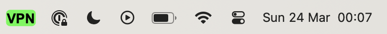
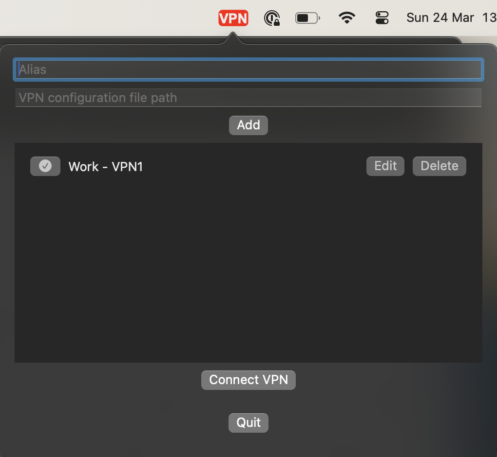

# vpnStatusBar

Este é um aplicativo agente gráfico do OpenFortiVPN, construído utilizando Swift. Sua funcionalidade é basicamente prover um mecanismo simples para conectar e desconectar da VPN, além de acompanhar o status da conexão de forma visual.

Indicador de VPN desconectada:


Indicador de VPN conectada:



Painel:



## Pré-requisitos

É necessário ter o openfortivpn instalado. Na versão atual, o aplicativo irá buscar o binário do openfortivpn no caminho:

```bash
/opt/homebrew/bin/openfortivpn
```

> Caso tenha instalado o openfortivpn por um meio diferente do Homebrew (`brew install openfortivpn`), considere criar um link simbólico do local do binário para o caminho citado acima.

Edite o arquivo sudoers do sistema e adicione:

```
seu-usuário-aqui ALL=(ALL) NOPASSWD: /opt/homebrew/bin/openfortivpn
seu-usuário-aqui ALL=(ALL) NOPASSWD: /usr/bin/pkill -f openfortivpn
```
## Instruções

Exemplo de arquivo de configurações:

```txt
host=10.0.0.2
port=443
username=seu-username
password=sua-senha
trusted-cert=id-do-certificado
```

> Para obter o *trusted-cert* você pode executar `echo | openssl s_client -connect 10.0.0.2:443 2>/dev/null | openssl x509 -noout -fingerprint -sha256 | tr -d ':'`. Lembre-se de trocar o host e porta conforme necessário.
